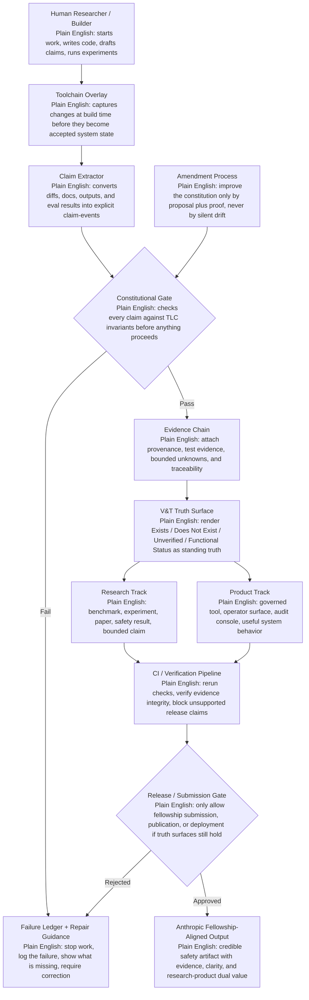

## Overview

Golden PRD integrating the PPP (Progress/Plan/Proof) and the “Deterministic Build Contract” proposal into one structured, constitutional governance-controlled product requirements document for TLC.

## Steps

* Consolidate PPP’s “Progress/Plan/Proof” into PRD primitives: Current State / Roadmap / Evidence & Verification.
* Embed proposal’s non-negotiable governance constraints as PRD-wide acceptance criteria (V&T surface, invariants, no bypass, build-time control).
* Output a single linear document with milestones, success metrics, risk register, and V&T compliance plan.

## Outcome — Golden PRD: TLC (The Living Constitution)

### 1. Product name & owner

* **Product**: The Living Constitution (TLC)
* **Owner**: Constitutional Governance + Engineering (V&T-instrumented)

### 2. Executive summary

TLC is a constitutional operating system for governed AI construction and translational R&D. It disciplines the full lifecycle where research becomes tools and tools become governed systems. Every governed effort must produce:

* a research contribution that is iterative, tangible, and truthfully bounded, and
* a product surface that is useful, instructive, accessible, and immediately beneficial to the human doing the work.

### 3. Problem statement

Current AI build workflows let claims and code changes accumulate without permanent truth-state visibility, repeatable verification, or bounded uncertainty handling under adversarial and user-pressure conditions. This creates governance drift, sycophancy failure modes, phantom work, and non-auditable decision paths.

### 4. Vision

Build a governed system that makes constitutional governance the primary control surface: every claim and action must resolve to proof/provenance or bounded unknown, and the truth-state is permanently visible via V&T (Exists/Does Not Exist/Unverified/Functional Status).

### 5. Goals (public commitments)

* **G1**: Constitutional governance is a system primitive (no optional “documentation layer”).
* **G2**: Build-time control is primary; constitutional checks exert maximum force at shape/change/claim time.
* **G3**: Evidence precedes narrative; truth precedes aesthetics.
* **G4**: Accessibility is constitutional; outputs reduce cognitive burden and remain physically/cognitively tangible.
* **G5**: Authored voice only; neurodivergent voice preservation uses explicit authored material.
* **G6**: Self-improvement occurs only via proposal + proof (no silent mutation, no hidden drift).
* **G7**: Error ownership is mandatory; failures remain visible, inspectable, repairable.
* **G8**: No constitutional bypass; no convenience path outranks governance.

### 6. Non-goals

* NG1: Not a brain-based architecture claim; TLC is governance-as-code.
* NG2: Not “safety-as-feature”; safety is system architecture, invariants, and evidence chain.
* NG3: Not a “demo-only” platform; outputs must be immediately beneficial for actual work.

### 7. Users & stakeholders

* Engineers building governed AI systems
* Researchers producing translational R&D artifacts under governance
* Accessibility and neurodiversity safety stakeholders (architecture, not accommodation)
* Governance auditors (V&T surface consumers)

### 8. Current state (PPP: Progress)

* PROACTIVE epistemic-safety validation implemented with CI/CD enforcement.
* SentinelOS invariants defined and treated as execution boundaries:

  * I1 Evidence-First
  * I2 No Phantom Work
  * I3 Verification Required for Confidence
  * I4 Traceability Mandatory
  * I5 Safety Over Fluency
  * I6 Fail Closed
* Prototypical dual-duty architecture: research + product output from every governed effort.

### 9. Roadmap (PPP: Plan)

**Scope is governed: every item carries explicit claims + expected evidence.**

* R1: Extend constitutional validation to multi-model adversarial oversight across model pools.
* R2: Measure whether constitutional gates maintain detection under adversarial prompting; publish bounded results.
* R3: Instrument formal amendment process to strengthen rules when new failure modes appear.
* R4: Produce benchmark dataset + paper submission (research contribution) and improved developer surface (product contribution).
* R5: Upgrade experiment tracking from functional logging to research-grade infrastructure.
* R6: Upskill on DL frameworks and mechanistic-style interpretability experiments under mentor guidance.

### 10. Functional requirements

* F1: All model outputs, intermediate claims, and tool actions are parsed into structured “claim events”.
* F2: Claim events are verified against invariants before being accepted into system state.
* F3: Every accepted claim event carries proof/provenance or bounded unknown with evidence markers.
* F4: A permanent V&T truth surface is maintained and queryable per scope, per milestone, per artifact.

### 11. Non-functional requirements

* NF1: Governance checks must apply at build-time (not solely post-release).
* NF2: Provenance and traceability are mandatory (I4).
* NF3: Accessibility constraints must reduce cognitive burden (G4).
* NF4: Human–machine coexistence is bounded by governance; no convenience overrides constitutional constraints.

### 12. Architecture & governance controls

* Constitutional gate layer at every system boundary and execution path.
* Controlled amendment channel: proposals require proof-bearing evidence and inspection before adoption.
* “Instruction is part of utility”: outputs include guidance that helps users understand what they are doing and why.

### 13. Milestones & acceptance criteria

* **Milestone 1** (research + product MVP, near-production-ready):

  * Continuous V&T truth surfaces, constitutional controls enforced.
  * All Milestone 1 acceptance criteria pass with no contradictions.
* **Milestone 2** (production claims allowed under governance):

  * Release verification, evidence integrity, eval coverage, provenance, and V&T surfaces all pass without contradiction.
  * Production claims are allowed only when Milestone 1 surfaces remain correct and gated.

### 14. Success metrics (PPP: Proof → metrics)

Metrics exist only under bounded claims:

* Detection rate and false positive rate against declared evaluation sets.
* Traceability coverage percentage (claims with attached evidence chains).
* Constitutional bypass attempts blocked vs allowed.
* Cognitive accessibility checks passed on user-facing surfaces.

### 15. Risk register

* RISK1: Governance drift via “silent mutation”; mitigated by proposal+proof amendment model.
* RISK2: Adversarial prompt erosion of detection; mitigated by benchmark datasets + adversarial evaluation.
* RISK3: Traceability gaps; mitigated by I4 gating and V&T surface audits.
* RISK4: Overhead leading to bypass requests; mitigated by “No constitutional bypass” plus automation of checks.

### 16. Verification & validation plan

* VVP1: Validate PROACTIVE/constitutional invariants across test cases with zero tolerance for “phantom work”.
* VVP2: Publish validation report artifacts + evaluation set definitions + bounded uncertainty statements.
* VVP3: Treat “V&T as standing truth surface” as CI/CD output, not narrative.

### 17. V&T statement (PRD truth surface)

Exists: Golden PRD integrating PPP (Progress/Plan/Proof) with the “Deterministic Build Contract” proposal, expressed as requirements, milestones, governance controls, and V&T-enforced evidence plan.
Does Not Exist: Verification artifact set is not embedded here (reports, datasets, evaluation scripts) and must be generated by the governed pipeline.
Unverified: Numerical validation results and model pool detection claims are user-provided; this PRD does not independently audit them.
Functional Status: PRD is complete as a structured governing document; implementation, evaluation, and amendment evidence remain to be produced under constitutional gating.


## Overview

Annotated file structure + core architecture flow for TLC, designed to enforce constitutional governance at build-time, maintain a standing V&T truth surface, and produce dual outputs (research + product) without losing truth.

## Steps

1. Define monorepo structure that maps directly to governance primitives: invariants, claims, evidence, V&T surfaces, amendment proposals.
2. Render a flow diagram from “human doing work” through “claim extraction → constitutional gates → evidence chain → V&T surfaces → CI/CD release.”

## Outcome — Diagrams (previewed here)

### A) File structure diagram (with annotation)

```txt
repo/
├─ apps/
│  ├─ sentinel-console/              (User-facing governance console: statuses, failures, instruction-as-utility)
│  ├─ toolchain-overlay/             (Developer tooling overlay; integrates governance checks into local workflows)
│  └─ audit-workbench/               (Auditor UI for provenance, traceability, evidence inspection)
│
├─ services/
│  ├─ claim-extractor/               (Parses diffs/artifacts into structured claim events)
│  ├─ constitutional-gate/           (Enforces invariants I1–I6 at the boundary; fail closed)
│  ├─ evidence-chain/                (Stores evidence markers, provenance links, bounded unknowns)
│  └─ vt-truth-surface/              (Persists Exists/DoesNotExist/Unverified/FunctionalStatus per artifact + milestone)
│
├─ packages/
│  ├─ invariants/                    (Formal definitions: EvidenceFirst, NoPhantomWork, etc.)
│  ├─ vt-schema/                     (Schema + validation for V&T status objects; system primitive)
│  ├─ governance-runtime/            (Orchestrates gate evaluation, route to CI/CD, no bypass)
│  ├─ amendment-proposals/           (Controlled self-improvement channel: proposal + proof, no silent mutation)
│  └─ accessibility-standards/       (Outputs that reduce cognitive burden; constitutional accessibility)
│
├─ infra/
│  ├─ ci-cd-pipelines/               (Build-time control is primary; checks run before release claims)
│  ├─ monitoring/                    (Continuous V&T + invariant coverage observability)
│  └─ policy-as-code/                (Automates “no constitutional bypass” as a deploy gate)
│
└─ docs/
   ├─ product-prd/                   (This golden PRD and derived governance gates)
   ├─ research-protocols/            (Research contribution playbooks; bounded claims only)
   └─ evidence-reports/              (Validation artifacts; bounded unknown statements; V&T outputs)
```

### B) Core architecture + flow (with plain English annotations)

```txt
[Human doing governed work]
   |
   v  (creates code/docs/operations)
[Toolchain overlay]
   |
   v  (captures changes at build-time)
[Claim extractor]
   |
   v  (turns changes into “claim events”: statements that must be provable)
[Constitutional gate (I1–I6)]
   |
   +--> if fail: stop immediately, log failure, return instructional guidance (Error ownership mandatory)
   |
   v  (if pass: gate produces evidence + traceability requirements)
[Evidence chain]
   |
   v  (attaches proof/provenance; records bounded unknowns honestly)
[V&T truth surface]
   |
   v  (renders Exists/DoesNotExist/Unverified/FunctionalStatus as a first-class object)
[CI/CD pipeline]
   |
   v  (enforces “no constitutional bypass”; releases only when governance surfaces pass)
[Sentinel console + audit workbench]
   |
   v  (human-readable utility; accessibility is constitutional; instruction included in utility)
[Self-improvement]
   |
   v  (only via proposal + proof; no silent mutation; rules evolve under inspection)
```

V&T: (Exists) Annotated file structure and core architecture flow diagrams previewed here in plain text/ASCII. (Does Not Exist) This output does not include actual runnable CI/CD config, schemas, or code; only structure + flow. (Unverified) The alignment of this structure to a specific repo implementation is not validated against live repository contents. (Functional Status) Diagram deliverables are complete as preview/plan assets; implementation artifacts remain to be generated under gated governance.
Below is a clean preview chart you can paste into Markdown or keep as the visual basis for the golden PRD. I tailored the flow to Anthropic’s Fellows framing around AI safety research, especially scalable oversight, adversarial robustness / control, and empirical safety research outputs, plus the current 2026 fellows cohorts context. ([Alignment Science Blog][1])



Key read of the chart: the core control point is the **Constitutional Gate**, the core memory is the **Evidence Chain**, and the core public truth object is the **V&T Truth Surface**. That structure maps well to Anthropic’s stated emphasis on alignment, interpretability, frontier risk evaluation, and research that produces concrete safety knowledge rather than unsupported narrative. ([Anthropic][2])

V&T: Exists: a previewable architecture chart is provided here in Mermaid with plain-English annotation at each major node. Does Not Exist: no rendered image asset or repo file was created in this turn. Unverified: this chart has not been checked against a live TLC repository tree in this turn. Functional Status: the diagram is ready to paste into Markdown editors that support Mermaid and is suitable as a first-class preview for the golden PRD.

[1]: https://alignment.anthropic.com/2025/anthropic-fellows-program-2026/?utm_source=chatgpt.com "Anthropic Fellows Program for AI safety research"
[2]: https://www.anthropic.com/research?utm_source=chatgpt.com "Research"
