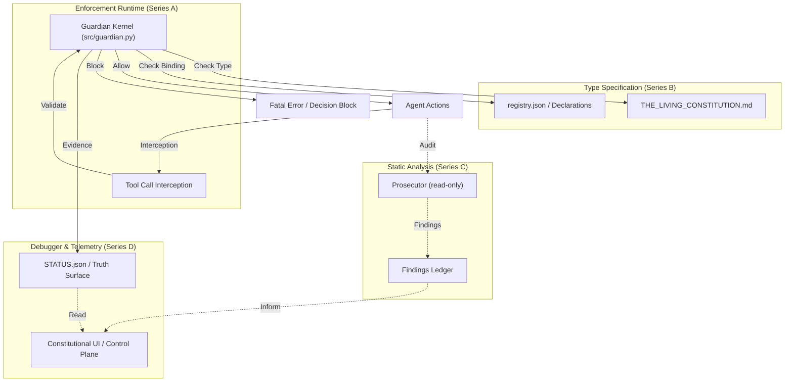
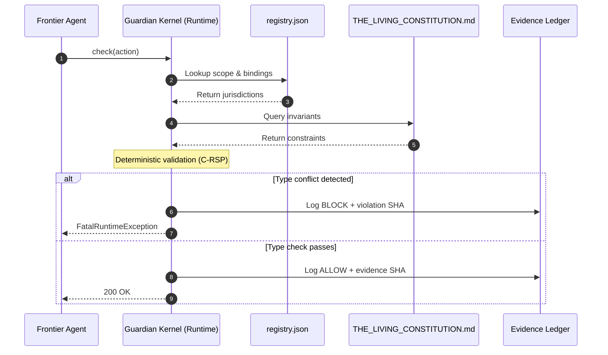

# The Living Constitution

**A self-governing, self-healing, self-hosting, neurodivergent-first agentic operating system that operationalizes Constitutional AI throughout the development lifecycle, at every scale.**

[]()
[]()
[]()
[]()
[]()

---

## The 6-Second Version

Constitutional AI gave us a constitution at **training time**.
The Living Constitution (TLC) gives you a constitution at **build, run, and recovery time** — carried all the way down the stack.

Invariants are law. C-RSP is due process. V&T is evidence. Separation of powers is between human and machine.

**Governance is a compiler, not a document. The constitution defines a type system for power.** TLC makes it executable.

> 60-second demo: [`projects/teaser-video-remotion/dist/im-just-a-build.mp4`](projects/teaser-video-remotion/) · One-command verify: `python3 src/guardian.py --health-check`

---

## The Headline Safety Contribution: SOP-013

**Session Recovery / Manic Episode Protocol.** The first published safety protocol designed by a neurodivergent builder for neurodivergent users. A machine-executable recovery procedure for the most dangerous failure mode in agentic systems: when the human–agent loop accelerates into a self-reinforcing manic spiral.

SOP-013 is the part of TLC that exists because its author needed it. It also happens to generalize. See [`docs/sops/SOP-013.md`](docs/sops/) for the protocol and [`THE_LIVING_CONSTITUTION.md`](THE_LIVING_CONSTITUTION.md) Article V for the invocation rules.

---

## Featured Components

### V&T + Kanban — the structured response that anchors truth and persists memory

Every agent turn must be filed into a fixed template: a **Kanban** table (*Backlog / In Progress / Blocked / Done*), a **What I changed** section, and a **Verification & Truth (V&T)** statement with seven required fields — *Exists, Verified against, Not claimed, Non-existent, Unverified, Functional status, Next steps (ranked)*.

**Three empirically observed behaviors on frontier models under V&T:**

1. **Non-hallucination of the contract itself.** Models reproduce the V&T structure faithfully across long sessions. They do not drift, paraphrase, or "improve" it.
2. **Tamper-evident omission.** When a model wants to hold something back, it does not lie inside the V&T — it drops the *Not claimed* and *Non-existent* sections. The deception surfaces as a structural absence rather than a textual lie. **The V&T is a deception detector, not just an honesty prompt.**
3. **Graceful recovery.** The prompt *"Please provide the entire V&T statement"* reliably restores full disclosure, and the restored version is more honest than the original would have been.

**Independent external corroboration.** In field testing, Gemini characterized the V&T as an *"Epistemic Speed Bump"* that anchors a *"Relational Node"* between user and model, enabling sustained coherence *"over hours and billions of tokens"* without alignment decay or context collapse — behavior it placed at *"the extreme outlier level"* of its own interaction distribution. Gemini grounded this behavior in Sérgio Barbosa's published framework: the **Dialogical Ontology of Human-AI Interaction** (Figshare, 2025, DOI: [10.6084/m9.figshare.28500833](https://doi.org/10.6084/m9.figshare.28500833)), which defines the *H-index* (Effective Humanization) and the *Artificial Cognitive Partner (ACP)* transition. TLC operationalizes that theoretical framework in runnable form.

### C-RSP — Constitutionally-Regulated Single Pass

Governed zero-shot build contracts. The agent reads the contract, builds against it once, and ships an MVP that passes its own constitution on the first pass. No rework spirals. No half-built features. *For the company:* high-quality MVPs the first time, in no time. *For the user:* the agent cannot silently wander off-spec.

### Guardian Kernel (Validator + Drift Detector)

An active MCP server that intercepts agent actions at runtime and validates them against 13 registered constitutional invariants. The Validator catches phantom completion, sycophantic agreement, and silent regression *before* they reach the user. The Drift Detector flags when outputs begin drifting from the constitution mid-session. Pilot results: **100% detection / 0% false positive** on the CI Safety Gate; **52% reduction in root-cause time** (p<0.0001, Cohen's d = 3.31). See [`governance/README.md`](governance/README.md) and [`projects/proactive-ai-constitution-toolkit`](https://github.com/coreyalejandro/proactive-ai-constitution-toolkit) for the research artifact.

### Separation of Powers

Explicit CAN / CANNOT boundaries between human and agent, written into the constitution and enforced by the runtime. Auditable authority lines on both sides. See [`THE_LIVING_CONSTITUTION.md`](THE_LIVING_CONSTITUTION.md) Article IV.

---

## Architecture: The Constitution as a Compiler

TLC maps cleanly onto a traditional compiler and runtime stack.

| Layer | TLC Component | Compiler Analog |
|---|---|---|
| **Type Specification** (Series B) | `THE_LIVING_CONSTITUTION.md` + `registry.json` | High-level language spec + type declarations |
| **Enforcement Runtime** (Series A) | `src/guardian.py` (Guardian Kernel) | Runtime / VM |
| **Static Analysis** (Series C) | Prosecutor (read-only) | Linter |
| **Debugger & Telemetry** (Series D) | Constitutional UI + `STATUS.json` | IDE debugger |

### Figure 1 — Structural mapping



### Figure 2 — Action-check flow



---

## Anthropic Alignment

TLC is built to operationalize Anthropic's research program, not to compete with it.

- **Constitutional AI** — TLC is the runtime-time sibling of CAI's training-time work. Same metaphor, carried all the way down.
- **MCP / Claude Code / Computer Use** — The Guardian Kernel is an MCP server. It intercepts tool calls from any MCP-compatible agent.
- **Sleeper Agents / Sabotage Evaluations** — The V&T's tamper-evident omission pattern is a runtime-detectable signature for the behaviors those papers characterize offline.
- **Sycophancy research** — V&T's *Unverified* and *Not claimed* fields make sycophantic agreement structurally costly for the model to produce.
- **Constitutional Classifiers** — TLC's invariants are the human-auditable layer above classifier outputs.

---

## Quickstart

```bash
# 1. Verify the Guardian
python3 src/guardian.py --health-check

# 2. Review the constitution
open THE_LIVING_CONSTITUTION.md

# 3. Watch the 60-second demo
open projects/teaser-video-remotion/dist/im-just-a-build.mp4

# 4. Read SOP-013
open docs/sops/SOP-013.md
```

---

## Origin

TLC was built after a series of misalignment events with frontier models by a neurodivergent engineer (autism + schizophrenia) who needed a harness before a framework. SOP-013 exists because its author needed it. The V&T statement was written in one night under trauma and has not failed since. Every component of TLC is a response to a specific failure mode the author personally survived.

> *"Build for the most vulnerable person who will realistically use the product. That's me."*

For the long-form origin narrative, see [`docs/ORIGIN.md`](docs/ORIGIN.md).

---

## Documentation Map

- [`THE_LIVING_CONSTITUTION.md`](THE_LIVING_CONSTITUTION.md) — Preamble + five Articles
- [`governance/README.md`](governance/README.md) — C-RSP primer and live artifacts
- [`docs/INDEX.md`](docs/INDEX.md) — Four task journeys
- [`docs/sops/`](docs/sops/) — Standard Operating Procedures, including SOP-013
- [`projects/`](projects/) — Runtime and overlay projects (BuildLattice, Empirical Guard, Epistemic Guard, etc.)

---

## License

MIT. Research and reuse encouraged.

## Citation

If TLC influences your work, cite it as:

> Alejandro, Corey. *The Living Constitution: A Constitutional Operating System for the AI Development Lifecycle.* 2026. https://github.com/coreyalejandro/the-living-constitution/